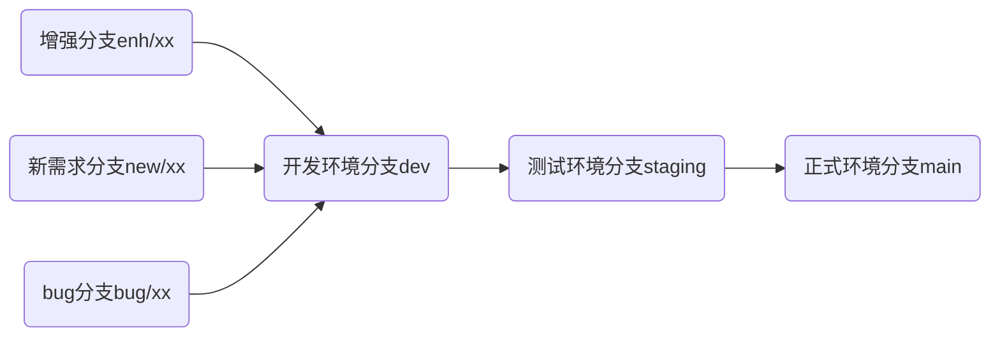

# Git

## 分支规范

**不允许在`main/staging/dev`分支下进行提交代码**

- `mian` 分支

  用于发布正式环境的分支，发布成功后会将`mian`分支的代码标记一个`TAG`。该分支只能由`staging`分支合并过去。**不允许其它分支会方式提交代码到该分支中**

- `staging`分支

  用于发布测试环境的分支，该分支只能由`dev`分支合并过去。**不允许其它分支会方式提交代码到该分支中**。合并到`staging`分支的时候会自动构建镜像并且自动发布测试环境。

- `dev`分支

  用于发布本地环境分支，注意并不是在这个分支中做开发。只能由下面的分支合并到`dev`分支中。主要用来构建发布到本地的环境。如果你的项目还没有第一个正式环境的版本允许在该分支下开发，一旦发布第一个版本到正式环境后只能由功能分支合并过来

- `new/xx` 新功能分支（开发分支）

  如果系统中没有这个功能则创建`new/xx`分支，`xx`表示`git`仓库中的`issues`编号。所有的新需求功能需要在`git`仓库中创建一个需求`issues`并且需要尽量详细的描述该功能作用以及实现

- `enh/xx` 功能增强分支（开发分支）

  如果系统中已经有这个功能（需求变更或者添加新功能）则创建`enh/xx`分支，`xx`表示`git`仓库中的`issues`编号。所有的需求变更需要在`git`仓库中创建一个需求`issues`并且需要尽量详细的描述该功能以及变更影响范围

- `bug/xx` Bug修复分支（开发分支）

  系统出现`BUG`的时候创建的分支，`xx`表示`git`仓库中的`issues`编号。需要详细记录`BUG`问题所在，以及重现步骤。


**分支演变**



所有的**开发分支**不能相互合并。合并的时候使用`rebase`来操作，不要使用`merge`命令以保证分支的简洁性。

创建`PR`的时候需要在标题中描述清楚合并理由，并且需要关闭关联的`issues`编号。例如：`完成用户登录功能 close #1`，在合并完成的时候它会关闭`#1`的`issues`

## 提交规范

前后端项目 Git 提交规范，前后端提交代码谨遵以下提交规范。将来发布正式环境的时候会将`feat`和`fix`的提交日志作为发布公告给到公司，所以务必详细说明这次提交做了些什么事情

- 参考 [vue](https://github.com/vuejs/vue/blob/dev/.github/COMMIT_CONVENTION.md) 规范 ([Angular](https://github.com/conventional-changelog/conventional-changelog/tree/master/packages/conventional-changelog-angular))

  - `feat` 增加新功能
  - `fix` 修复问题/BUG
  - `style` 代码风格相关无影响运行结果的
  - `perf` 优化/性能提升
  - `refactor` 重构
  - `revert` 撤销修改
  - `test` 测试相关
  - `docs` 文档/注释
  - `chore` 依赖更新/脚手架配置修改等
  - `workflow` 工作流改进
  - `ci` 持续集成
  - `mod` 不确定分类的修改
  - `wip` 开发中
  - `types` 类型修改

- 示例

```bash
git commit -m 'feat(home): add home page'
```

`feat(home)`括号内表示`scope`，可以选择性增加。

```sh
git commit -m 'feat: add home page'
```


## Git 代码提交辅助工具

可以选择性安装，但项目提交**必须按照 Git 提交规范执行**

- 全局安装`czg`

```sh
pnpm add -g czg
```

检查是否安装成功

```sh
git czg -h
```

- 使用

  以前提交代码的时候使用`git commit -m ""`安装了 Git 辅助工具之后换成`git czg`然后根据提示填写

  前端可以使用命令提交

```sh
pnpm commit
```

后端提交命令

```sh
sh commit.sh
```

后端发布版本可以使用

```sh
sh version.sh
```

## 生成 Git 日志

根据上述`Git`提交规范生成作为发布产品的变更日志

- 全局安装`conventional-changelog-cli`
  运行命令从 `git metadata` 生成变更日志

```sh
pnpm add -g conventional-changelog-cli
```

- 前端生成日志

```sh
pnpm changelog
```

- 后端生成日志

```sh
sh changelog.sh
```

## 前端 Lint

### 介绍

::: tip 使用 lint 的好处

具备基本工程素养的同学都会注重编码规范，而代码风格检查（Code Linting，简称 Lint）是保障代码规范一致性的重要手段。

遵循相应的代码规范有以下好处

- 较少 bug 错误率
- 高效的开发效率
- 更高的可读性

:::

项目内集成了以下几种代码校验方式

1. eslint 用于校验代码格式规范
2. commitlint 用于校验 git 提交信息规范
3. stylelint 用于校验 css/scss 规范

::: warning

lint 不是必须的，但是很有必要，一个项目做大了以后或者参与人员过多后，就会出现各种风格迥异的代码，对后续的维护造成了一定的麻烦

:::

### ESLint

ESLint 是一个代码规范和错误检查工具，有以下几个特性

- 所有东西都是可以插拔的。你可以调用任意的 rule api 或者 formatter api 去打包或者定义 rule or formatter。
- 任意的 rule 都是独立的
- 没有特定的 coding style，你可以自己配置

#### 手动校验代码

```bash
# 执行下面代码.能修复的会自动修复，不能修复的需要手动修改
pnpm run lint:eslint
```

#### 配置项

项目的 eslint 配置位于根目录下 **.eslintrc.js** 内，可以根据团队自行修改代码规范

#### 编辑器配合

推荐使用 vscode 进行开发，vscode 自带 eslint 插件，可以自动修改一些错误。

同时项目内也自带了 vscode eslint 配置，具体在 `.vscode/setting.json` 文件夹内部。只要使用 vscode 开发不用任何设置即可使用

### CommitLint

在一个团队中，每个人的 git 的 commit 信息都不一样，五花八门，没有一个机制很难保证规范化，如何才能规范化呢？可能你想到的是 git 的 hook 机制，去写 shell 脚本去实现。这当然可以，其实 JavaScript 有一个很好的工具可以实现这个模板，它就是 commitlint（用于校验 git 提交信息规范）。

#### 配置

commit-lint 的配置位于项目根目录下 **commitlint.config.js**

#### 如何关闭

在 `.husky/commit-msg` 内注释以下代码即可

```bash
# npx --no-install commitlint --edit "$1"
```

### Stylelint

stylelint 用于校验项目内部 css 的风格,加上编辑器的自动修复，可以很好的统一项目内部 css 风格

#### 配置

stylelint 配置位于根目录下 **stylelint.config.js**

#### 编辑器配合

如果您使用的是 vscode 编辑器的话，只需要安装下面插件，即可在保存的时候自动格式化文件内部 css 样式

**插件**

[StyleLint](https://marketplace.visualstudio.com/items?itemName=stylelint.vscode-stylelint)

### Git Hook

git hook 一般结合各种 lint，在 git 提交代码的时候进行代码风格校验，如果校验没通过，则不会进行提交。需要开发者自行修改后再次进行提交

#### husky

有一个问题就是校验会校验全部代码，但是我们只想校验我们自己提交的代码，这个时候就可以使用 husky。

最有效的解决方案就是将 Lint 校验放到本地，常见做法是使用 husky 或者 pre-commit 在本地提交之前先做一次 Lint 校验。

项目在 `.husky` 内部定义了相应的 hooks

#### 如何关闭

```bash
# 删除husky依赖即可
yarn remove huksy
```

#### 如何跳过某一个检查

```bash
# 加上 --no-verify即可跳过git hook校验（--no-verify 简写为 -n）
git commit -m "xxx" --no-verify
```

##### lint-staged

用于自动修复提交文件风格问题

**lint-staged** 配置位于项目目录下 **lint-staged.config.js**

```js
module.exports = {
  '*.{js,jsx,ts,tsx}': ['eslint --fix'],
  '*.vue': ['eslint --fix'],
  '*.{scss,less,styl,html}': ['stylelint --fix']
}
```
