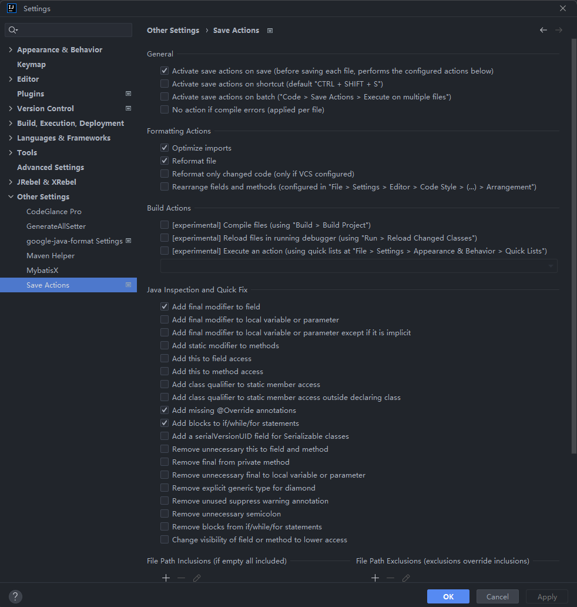
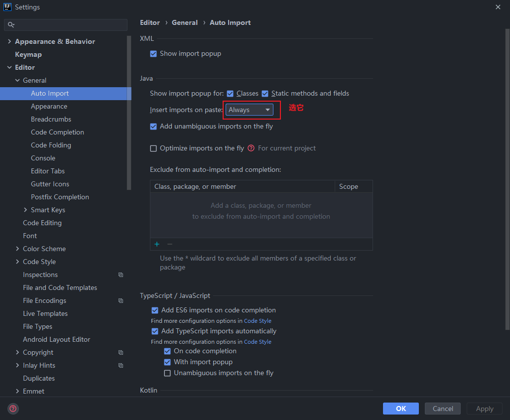
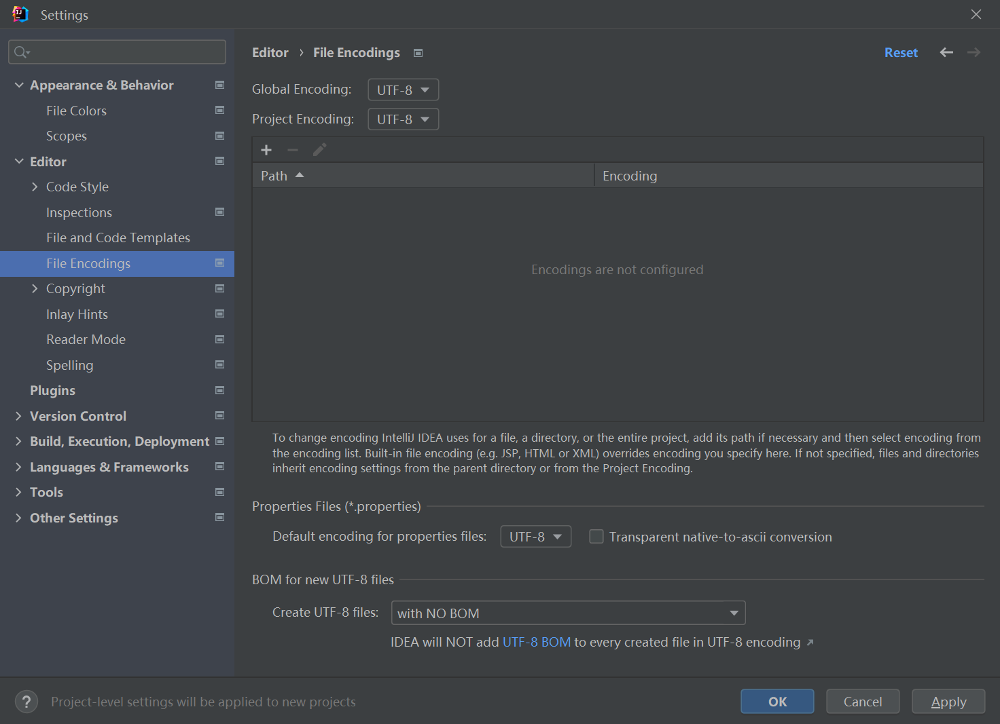
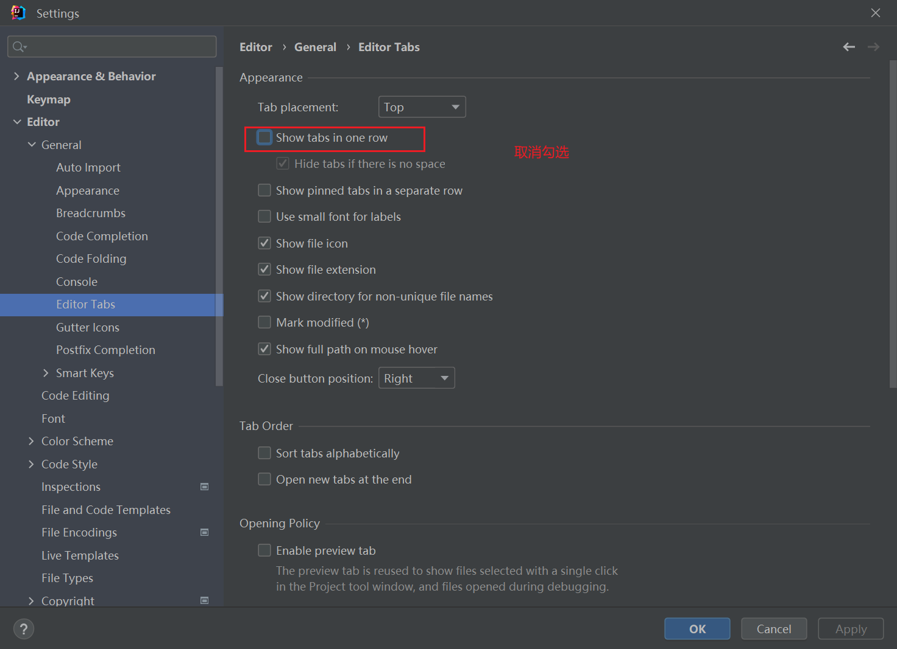
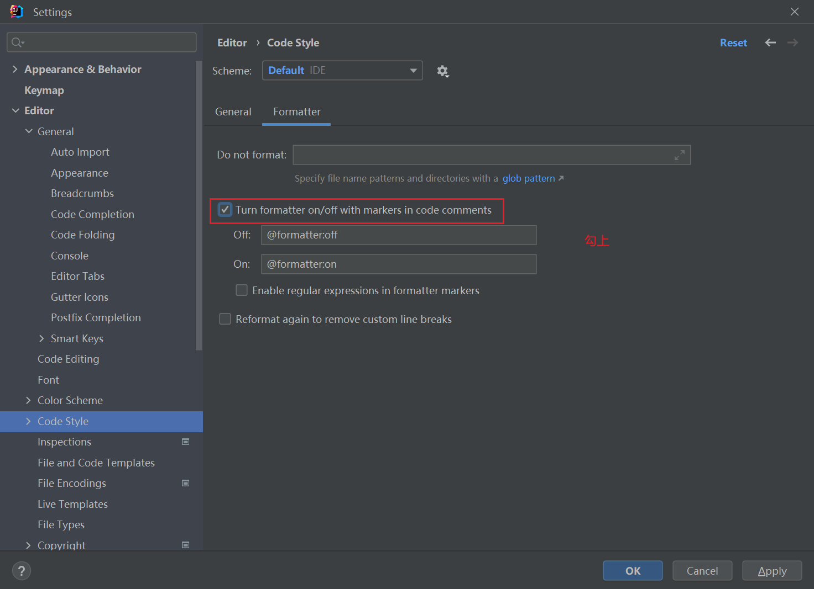
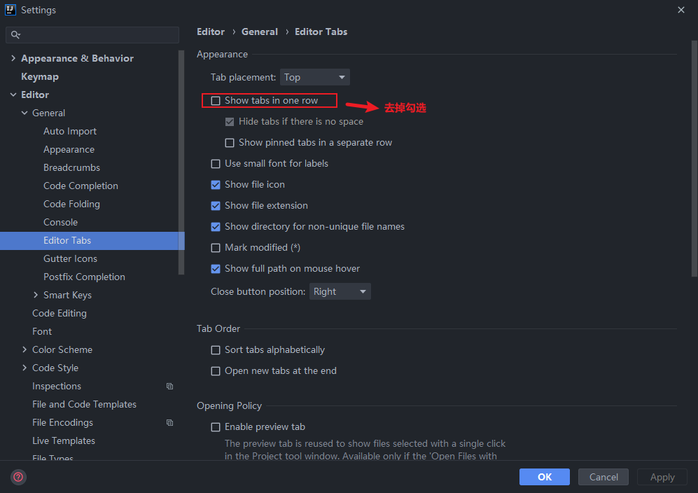

## 代码格式化

在对代码进行`mvn install`的时候如果你的代码不符合要求将会得到一个异常，这时候你可以使用`mvn spotless:apply`命令格式化代码让你的代码符合格式化要求。

当然我们使用`Idea`编码的时候可以安装插件，在保存代码的时候对代码自动的格式化它

- 安装`google-java-format`插件
- 打开`Idea`全局设置，找到`Other Settings` -> `google-java-format Settings`，然后启用`google-java-format`插件

如果你是高版本的`Idea`那么需要设置`Idea`的 `VM` 参数。[官方说明](https://github.com/google/google-java-format/blob/master/README.md#intellij-jre-config)

```txt
--add-exports=jdk.compiler/com.sun.tools.javac.api=ALL-UNNAMED
--add-exports=jdk.compiler/com.sun.tools.javac.code=ALL-UNNAMED
--add-exports=jdk.compiler/com.sun.tools.javac.file=ALL-UNNAMED
--add-exports=jdk.compiler/com.sun.tools.javac.parser=ALL-UNNAMED
--add-exports=jdk.compiler/com.sun.tools.javac.tree=ALL-UNNAMED
--add-exports=jdk.compiler/com.sun.tools.javac.util=ALL-UNNAMED
```

经过上一步`Idea`格式化(`Ctrl + Alt + L`)将符合规范要求

如果你在保存的时候格式化代码，那么可以使用`Save Actions`插件



## Idea 插件推荐

不推荐安装 AI 代码提示相关插件，因为它可能需要上传代码到云端。尽管有些不需要，但还是不推荐使用，这不是一个好的习惯。

1. `Lombok`
2. `GsonFormat`一键根据 json 文本生成 java 类
3. `Maven Helper`一键查看 maven 依赖，查看冲突的依赖，一键进行 exclude 依赖
4. `GenerateAllSetter`一键调用一个对象的所有 set 方法并且赋予默认值，在对象字段多的时候非常方便 强制
5. `Translation`翻译
6. `CodeGlance Pro`代码右侧小地图
7. `Key-Promoter-X`快捷键提示，熟悉之后可以关闭
8. `MybatisX`Mapper 和 xml 快速跳转插件
9. `RestfulTool`通过接口地址快速定位接口所在的方法位置
10. `Save Actions`在保存的时候做一些事情，比如优化导包等
11. `google-java-format` Google 代码风格格式化

## 配置相关

### 忽略大小写开关


### 智能导包开关



### 设置项目字符集



### 取消单行显示 tabs 的操作



### 格式化配置



```java
// 没有包裹格式化后的代码
public enum AbnormalStatus implements BaseTagEnum<Integer> {
    UNPROCESSED(5, "未处理", "danger"), PROCESSED(10, "已处理", "success");

    AbnormalStatus(Integer value, String desc, String tagType) {
        this.value = value;
        this.desc = desc;
        this.tagType = tagType;
    }
}

// 包裹后格式化后代码
public enum AbnormalStatus implements BaseTagEnum<Integer> {
    // @formatter:off
    UNPROCESSED(5, "未处理", "danger"),
    PROCESSED(10, "已处理", "success");
    // @formatter:on
    AbnormalStatus(Integer value, String desc, String tagType) {
        this.value = value;
        this.desc = desc;
        this.tagType = tagType;
    }
}
```

### 选项卡多行显示



### 模板配置

位置：`Settings ---> Editor ---> File and Code Templates`

- `Class 、Interface 、Enum 、Record 、AnnotationType` 模板。**注意下面的 `public class` 改成对应的文件类型**

  ```tex{10}
  #if (${PACKAGE_NAME} && ${PACKAGE_NAME} != "")package ${PACKAGE_NAME};#end
  #parse("File Header.java")

  /**
   *
   * @author laizuan
   * @date ${DATE} ${TIME}
   * @version 1.0
   */
  public class ${NAME} {
  }
  ```
