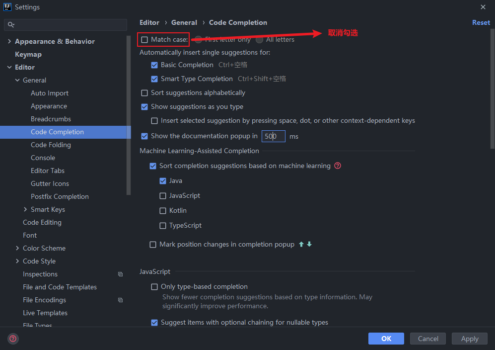

## 代码格式化

资源下载 [EclipseFormatter 下载](https://github.com/krasa/EclipseCodeFormatter/releases) [Alibaba 规范模板下载](https://github.com/alibaba/p3c/blob/master/p3c-formatter/eclipse-codestyle.xml) [教程参考](https://www.jianshu.com/p/9befe7710176)

- 安装插件：`eclipse code formatter`

- 导入`eclipse-codestyle.xml`

  `File->Settings->Other Setting -> eclipse code formatter`,选择`Use the eclipse code formatter-> eclipse java formatter config file` 选择下载的 xml 文件： `eclipse-codestyle.xml`

- 点 ok 完成

## Idea 插件推荐

不推荐安装 AI 代码提示相关插件，因为它可能需要上传代码到云端。尽管有些不需要，但还是不推荐使用，这不是一个好的习惯。

1. `Lombok`
2. `GsonFormat`一键根据 json 文本生成 java 类
3. `Maven Helper`一键查看 maven 依赖，查看冲突的依赖，一键进行 exclude 依赖
4. `GenerateAllSetter`一键调用一个对象的所有 set 方法并且赋予默认值，在对象字段多的时候非常方便 强制
5. `Translation`翻译
6. `CodeGlance Pro`代码右侧小地图
7. `Key-Promoter-X`快捷键提示，熟悉之后可以关闭
8. `MybatisX`Mapper 和 xml 快速跳转插件
9. `RestfulTool`通过接口地址快速定位接口所在的方法位置
10. `Save Actions`在保存的时候做一些事情，比如优化导包等

## 配置相关

### 忽略大小写开关



### 智能导包开关


### 设置项目字符集


### 取消单行显示 tabs 的操作


### 格式化配置


```java
// 没有包裹格式化后的代码
public enum AbnormalStatus implements BaseTagEnum<Integer> {
    UNPROCESSED(5, "未处理", "danger"), PROCESSED(10, "已处理", "success");

    AbnormalStatus(Integer value, String desc, String tagType) {
        this.value = value;
        this.desc = desc;
        this.tagType = tagType;
    }
}

// 包裹后格式化后代码
public enum AbnormalStatus implements BaseTagEnum<Integer> {
    // @formatter:off
    UNPROCESSED(5, "未处理", "danger"),
    PROCESSED(10, "已处理", "success");
    // @formatter:on
    AbnormalStatus(Integer value, String desc, String tagType) {
        this.value = value;
        this.desc = desc;
        this.tagType = tagType;
    }
}
```

### 选项卡多行显示


### 模板配置

位置：`Settings ---> Editor ---> File and Code Templates`

- `Class 、Interface 、Enum 、Record 、AnnotationType` 模板。**注意下面的 `public class` 改成对应的文件类型**

  ```tex{10}
  #if (${PACKAGE_NAME} && ${PACKAGE_NAME} != "")package ${PACKAGE_NAME};#end
  #parse("File Header.java")
  
  /**
   *
   * @author laizuan
   * @date ${DATE} ${TIME}
   * @version 1.0
   */
  public class ${NAME} {
  }
  ```
