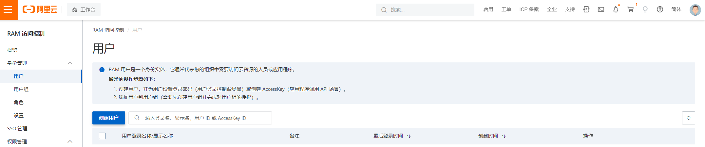
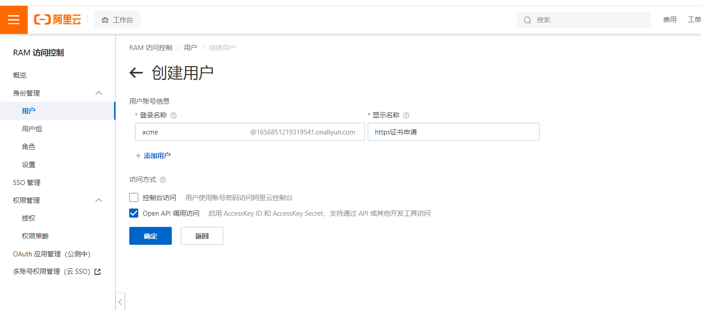
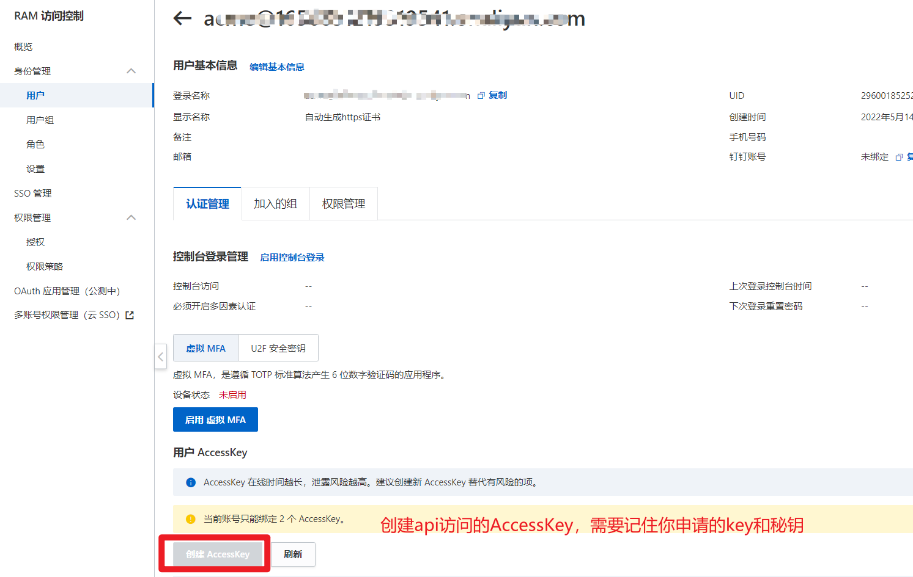
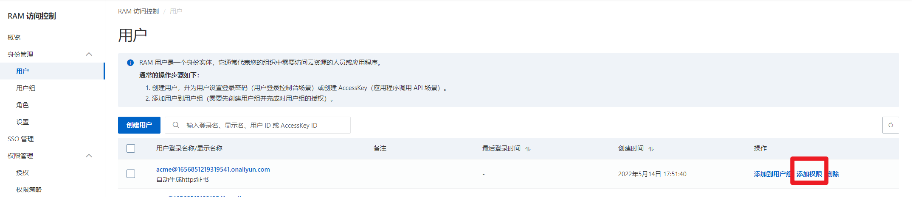
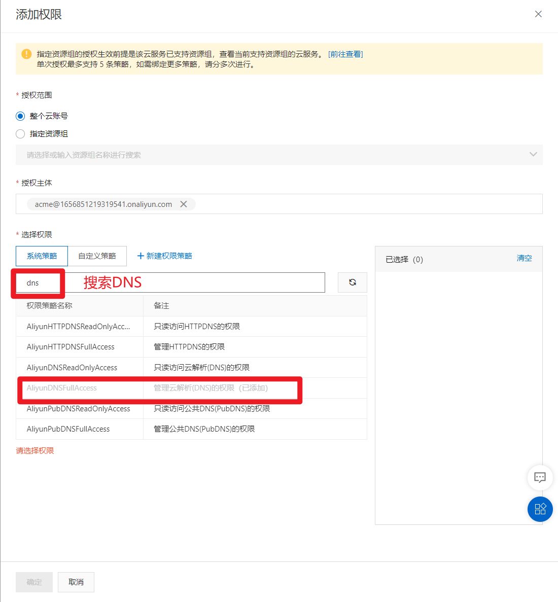

# acme.sh 部署 Let's Encrypt 泛域名 HTTPS

[acme.sh仓库地址](https://github.com/acmesh-official/acme.sh)

## 安装

email替换成你的邮箱，申请证书的时候需要有邮箱，可在这里先配置好。或者安装完`acme.sh`后使用`acme.sh --register-account -m xx@xxxxxx.com`这个命令设置你的邮箱

```shell
# 安装 sh 脚本
curl https://get.acme.sh | sh -s email=xx@xxxxxx.com

# 重载配置
source ~/.bashrc
```

安装完后建议开启`acme.sh`自动升级，如果不配置可能版本太低不会更新证书。踩坑经验

```shell
acme.sh  --upgrade  --auto-upgrade
```

关闭自动更新

```shell
acme.sh --upgrade  --auto-upgrade  0
```

## 验证域名

我们通过配置一个随机的 TXT 记录来验证域名。我使用的是阿里云，所有以阿里云为例，[acme.sh 多种域名验证方式](https://github.com/Neilpang/acme.sh#7-automatic-dns-api-integration)

acme.sh 访问阿里云 DNS 是通过阿里云 DNS 公开 API 以及用户的 AK 来进行交互的。

阿里云 AK 是使用[阿里云子账户](https://ram.console.aliyun.com/)来添加的。操作如下：











### 添加配置

```shell
vim /root/.bashrc
# 添加刚刚在阿里云申请的key。需要注意的是申请key的账号必须是你域名所在的账号。
export Ali_Key="AccessKeyId"
export Ali_Secret="AccessKeySecret"
```

使它生效

```shell
source ~/.bashrc
```

## 颁发证书

先配置`nginx`的`Diffie-Hellman(DH)`组

```shell
cd /mnt/nginx/ssl
openssl dhparam -out dhparams.pem 4096
```

申请证书

```shell
acme.sh --issue --dns dns_ali -d xxx.com -d *.xxx.com \
 --install-cert -d xxx.com \
--key-file /mnt/nginx/ssl/xxx.com.key \
--fullchain-file /mnt/nginx/ssl/xxx.com.cer \
--reloadcmd 'service nginx force-reload'
```

`dns_ali`是域名验证方式

`xxx.com`你的域名，`*.xxx.com`一并申请二级域名。更多级试着使用`*.*.xxx.com`(我没有试过3级以上的申请)

## Nginx SSL 配置

ssl.conf

```nginx
ssl on;
ssl_certificate /mnt/nginx/ssl/seedltd.cn.cer;
ssl_certificate_key /mnt/nginx/ssl/seedltd.cn.key;
ssl_session_timeout 30m;
ssl_protocols TLSv1 TLSv1.1 TLSv1.2 TLSv1.3;
#ssl_ciphers ECDH+AESGCM:DH+AESGCM:ECDH+AES256:DH+AES256:ECDH+AES128:DH+AES:ECDH+3DES:DH+3DES:RSA+AESGCM:RSA+AES:RSA+3DES:!aNULL:!MD5:!DSS;
ssl_ciphers ECDHE-ECDSA-AES128-GCM-SHA256:ECDHE-RSA-AES128-GCM-SHA256:ECDHE-ECDSA-AES256-GCM-SHA384:ECDHE-RSA-AES256-GCM-SHA384:ECDHE-ECDSA-CHACHA20-POLY1305:ECDHE-RSA-CHACHA20-POLY1305:DHE-RSA-AES128-GCM-SHA256:DHE-RSA-AES256-GCM-SHA384;
ssl_session_cache shared:SSL:10m;
ssl_dhparam /mnt/nginx/ssl/dhparams.pem;
ssl_prefer_server_ciphers on;
ssl_session_tickets off;

## Improves TTFB by using a smaller SSL buffer than the nginx default
ssl_buffer_size 8k;

## Enables OCSP stapling
ssl_stapling on;
ssl_stapling_verify on;

resolver 1.1.1.1 1.0.0.1 [2606:4700:4700::1111] [2606:4700:4700::1001] 8.8.8.8 8.8.4.4 208.67.222.222 208.67.220.220 valid=60s;
resolver_timeout 2s;

## Send header to tell the browser to prefer https to http traffic
add_header Strict-Transport-Security max-age=31536000;
```

代理配置

```nginx
upstream upms {
  keepalive 300;
  #max_fails默认值为1,fail_timeout默认值为10s,max_fails=0表示不做检查
  server 127.0.0.1:8000 weight=1 max_fails=5 fail_timeout=20;
}

server {
  listen 80;
  listen [::]:80;
  charset utf-8;
  server_name aa.xxx.com www.aa.xxx.com;
  return 301 https://aa.xxx.com$request_uri;
}

server {
  listen 443 ssl http2;
  listen [::]:443 ssl http2;
  charset utf-8;
  server_name aa.xxx.com www.aa.xxx.com;
  include /mnt/nginx/conf/ssl.conf;
    
  # 前端单页面
  location / {
    if ($request_filename ~* .*\.(?:htm|html)$) {
      # html页面不缓存
      add_header Cache-Control "private, no-store, no-cache, must-revalidate, proxy-revalidate";
    }
    root /mnt/project/client/upms;
    index index.html;
    try_files $uri $uri/ /index.html;
  }


  location ~ .*\.(gif|jpg|png|jpeg|ico|css|js|txt)$ {
    root /mnt/project/client/zkt/;
    expires 7d;
  }

  include /mnt/nginx/conf/conf.d/common/error_page.conf;

  # 后端代理
  location ~ ^/upms/ {
    proxy_pass http://upms;
    proxy_redirect default;
    proxy_set_header Host $http_host;
    proxy_set_header X-Real-IP $remote_addr; #获取客户端真实IP
    proxy_connect_timeout 30; #超时时间
    proxy_send_timeout 60;
    proxy_read_timeout 60;
    proxy_buffer_size 32k;
    proxy_buffering on; #开启缓冲区,减少磁盘io
    proxy_buffers 4 128k;
    proxy_busy_buffers_size 256k;
    proxy_max_temp_file_size 256k; #当超过内存允许储蓄大小，存到文件
  }
}
```

