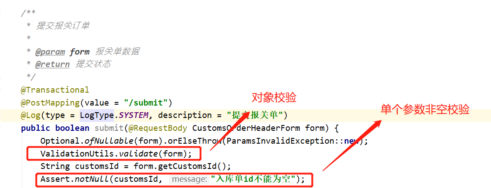
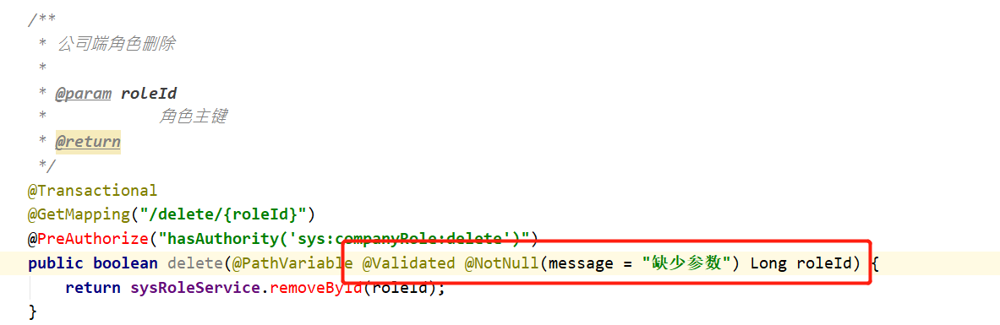
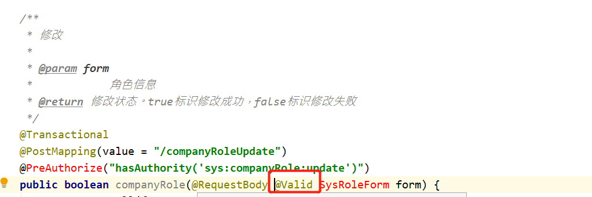

# java 后端开发规范
**此规范属于懿点网后端服务开发，所有开发者必须按照此规范开发。**
#### 1、参数校验
后端永远不要相信前端传输的参数值，所有提交参数必须通过校验才可以入库。目前校验有两种方式
* 工具类校验方式

* 使用注解 **_(推荐)_**
    1. 单个参数校验，在参数前面加上校验注解`@Validated`和规则注解`@NotNull`, 更多的规则注解请看下面面
    
    2. 实体校验
    在实体中配置校验规则，方法参数中添加`@Valid`即可
    

    3. 常用校验规则， 如下
    > @Null   被注释的元素必须为 null     
    @NotNull    被注释的元素必须不为 null     
    @AssertTrue     被注释的元素必须为 true     
    @AssertFalse    被注释的元素必须为 false     
    @Min(value)     被注释的元素必须是一个数字，其值必须大于等于指定的最小值    
    @Max(value)     被注释的元素必须是一个数字，其值必须小于等于指定的最大值    
    @DecimalMin(value)  被注释的元素必须是一个数字，其值必须大于等于指定的最小值     
    @DecimalMax(value)  被注释的元素必须是一个数字，其值必须小于等于指定的最大值     
    @Size(max=, min=)   被注释的元素的大小必须在指定的范围内     
    @Digits (integer, fraction)     被注释的元素必须是一个数字，其值必须在可接受的范围内     
    @Past   被注释的元素必须是一个过去的日期     
    @Future     被注释的元素必须是一个将来的日期     
    @Pattern(regex=,flag=)  被注释的元素必须符合指定的正则表达式     
    Hibernate Validator 附加的 constraint     
    @NotBlank(message =)   验证字符串非null，且长度必须大于0     
    @Email  被注释的元素必须是电子邮箱地址     
    @Length(min=,max=)  被注释的字符串的大小必须在指定的范围内     
    @NotEmpty   被注释的字符串的必须非空     
    @Range(min=,max=,message=)  被注释的元素必须在合适的范围内

### 2、权限
所有的敏感操作都必须要有权限控制，不能只在前端控制。敏感操作比如：新增、修改、删除等操作数据的动作。像查询这种一般不设置权限，但是**重要数据**必须加权限。

1. 权限命名规则：模块名称:模块对应的实体:动作

    删除用户做权限

    >`sys:user:delete`
    sys 大模块名称
    user 子模块名称
    delete 动作

2. 添加权限方式

    > `@PreAuthorize("hasRole('admin')")`  是否拥有admin角色    
 `@PreAnyAuthorize("hasRole('admin','test')")`  是否拥有admin角色   
 `@PreAuthorize("hasAuthority('sys:user:delete')")`  是否有`sys:user:delete`权限    
`@PreAuthorize("isAuthenticated()")` 添加登录权限判断，登录才可以调用   
`@PostAuthorize` 方法调用之后，如果表达式的结果为false，则抛出异常   
`@PreFilter` 方法调用之前，过滤进入方法的输入值     
`@PostFilter` 方法调用之后，过滤方法的结果值    

### 3、数据实体传递
不同的实体后缀作用域不同，切记不能混淆使用。每个模型类型应当遵循最小原则，用不上的字段请删除。
* 示例     

    `SearchForm` 用来接受列表查询条件参数，里面只需要包含需要用的上的搜索条件字段即可     
    `Form` 接受前端数据操作实体，**不应该包含用户不可以修改的字段**。比如：创建人、创建时间、修改人、修改时间等...

* 命名规则解释      
    1. 数据库实体pojo类只能和数据库打交道
    2. VO实体，返回前端的视图实体类
    3. Form实体，接收参数映射
    4. SearchForm实体，接收列表查询参数

### 4、实体继承
1. pojo对象涉及到创建人、修改人、创建时间、修改时间的必须继承`BasePojo`类
2. SearchForm实体继承`BaseSearchForm`类