# Git 使用小技巧

除了提交、拉取、推送常用命令外其它非常实用的 Git 命令

> [原文](https://juejin.cn/post/7108602508888506382)

## stash

官方解释：当您想记录工作目录和索引的当前状态，但又想返回一个干净的工作目录时，请使用 `git stash`。该命令将保存本地修改，并恢复工作目录以匹配头部提交。

stash 命令能够将还未 `commit` 的代码存起来，让你的工作目录变得干净。

### 应用场景

某一天你正在 `new/xx` 分支开发新需求，突然产品经理跑过来说线上有` bug`，必须马上修复。而此时你的功能开发到一半，于是你急忙想切到 `bug/xx` 分支，然后你就会看到以下报错：

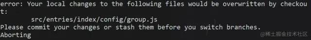

因为当前有文件更改了，需要提交 `commit` 保持工作区干净才能切分支。由于情况紧急，你只有急忙 `commit` 上去，`commit` 信息也随便写了个`暂存代码`，于是该分支提交记录就留了一条黑历史…

### 命令使用

```shell
git stash
```

就这么简单，代码就被存起来了。

当你修复完线上问题，切回 `new/xx` 分支，想恢复代码也只需要：

### 相关命令

```shell
# 保存当前未commit的代码
git stash

# 保存当前未commit的代码并添加备注
git stash save "备注的内容"

# 列出stash的所有记录
git stash list

# 删除stash的所有记录
git stash clear

# 应用最近一次的stash
git stash apply

# 应用最近一次的stash，随后删除该记录
git stash pop

# 删除最近的一次stash
git stash drop
```

当有多条 stash，可以指定操作 stash，首先使用 stash list 列出所有记录：

```txt
$ git stash list
stash@{0}: WIP on ...
stash@{1}: WIP on ...
stash@{2}: On ...
```

pop，drop 同理。

### Vscode 操作

`stash` 代码

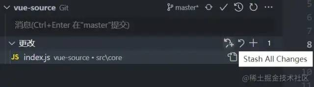

填写备注内容，然后`Enter`

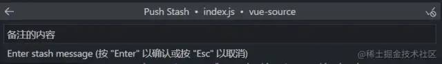

在 `STASHES` 菜单中可以看到保存的 `stash`

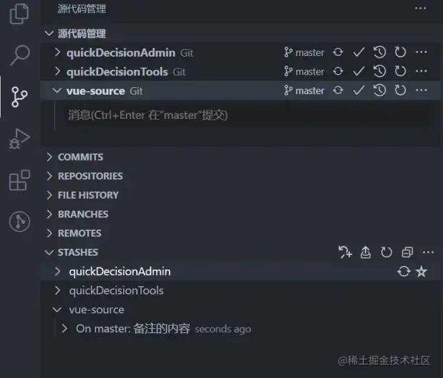

先点击 `stash` 记录旁的小箭头，再点击 `apply` 或者 `pop` 都可恢复 `stash`

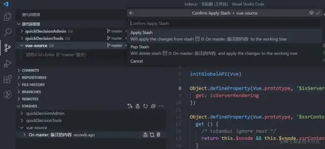

## reset --soft

完全不接触索引文件或工作树（但会像所有模式一样，将头部重置为）。这使您的所有更改的文件更改为“要提交的更改”。

回退你已提交的 `commit`，并将 `commit` 的修改内容放回到暂存区。

一般我们在使用 `reset` 命令时，`git reset --hard` 会被提及的比较多，它能让 `commit` 记录强制回溯到某一个节点。而 `git reset --soft` 的作用正如其名，`--soft(柔软的)` 除了回溯节点外，还会保留节点的修改内容。

### 应用场景

回溯节点，为什么要保留修改内容？

应用场景 1：有时候手滑不小心把不该提交的内容 `commit` 了，这时想改回来，只能再 `commit` 一次，又多一条`黑历史`。

应用场景 2：规范些的团队，一般对于 `commit` 的内容要求职责明确，颗粒度要细，便于后续出现问题排查。本来属于两块不同功能的修改，一起 `commit` 上去，这种就属于不规范。这次恰好又手滑了，一次性 `commit` 上去。

### 命令使用

学会 `reset --soft` 之后，你只需要：

```txt
# 恢复最近一次 commit
git reset --soft HEAD^
```

`reset --soft` 相当于后悔药，给你重新改过的机会。对于上面的场景，就可以再次修改重新提交，保持干净的 `commit` 记录。

以上说的是还未 `push` 的 `commit`。对于已经 `push` 的 `commit`，也可以使用该命令，不过再次 push 时，由于远程分支和本地分支有差异，需要强制推送 `git push -f` 来覆盖被 `reset` 的 `commit`

还有一点需要注意，在 `reset --soft` 指定 `commit` 号时，会将该 `commit` 到最近一次 `commit` 的所有修改内容全部恢复，而不是只针对该 `commit`

### 举例

`commit` 记录有 `c、b、a`

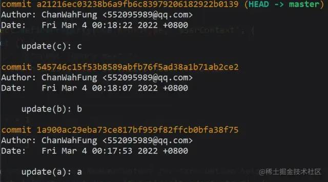

`reset` 到 `a`

```shell
git reset --soft 1a900ac29eba73ce817bf959f82ffcb0bfa38f75
```

此时的 `HEAD` 到了 `a`，而 `b、c` 的修改内容都回到了暂存区。

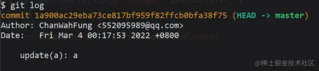

## revert

给定一个或多个现有提交，恢复相关提交引入的更改，并记录一些这些更改的新提交。这就要求你的工作树是干净的（没有来自头部的修改）。

将现有的提交还原，恢复提交的内容，并生成一条还原记录。

### 应用场景

应用场景：有一天测试突然跟你说，你开发上线的功能有问题，需要马上撤回，否则会影响到系统使用。这时可能会想到用 `reset` 回退，可是你看了看分支上最新的提交还有其他同事的代码，用 `reset` 会把这部分代码也撤回了。由于情况紧急，又想不到好方法，还是任性的使用 `reset`，然后再让同事把他的代码合一遍（同事听到想打人），于是你的技术形象在同事眼里一落千丈。

### 命令使用

`revert` 普通提交

现在 `master` 记录如下：

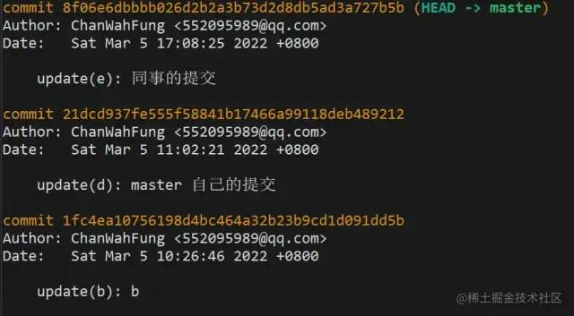

```shell
git revert 21dcd937fe555f58841b17466a99118deb489212
```

`revert` 掉自己提交的 `commit`

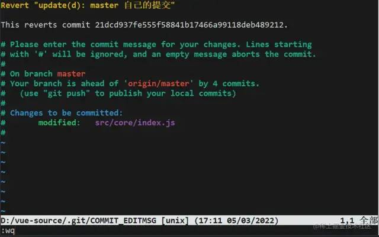
因为 `revert` 会生成一条新的提交记录，这时会让你编辑提交信息，编辑完后 `:wq` 保存退出就好了

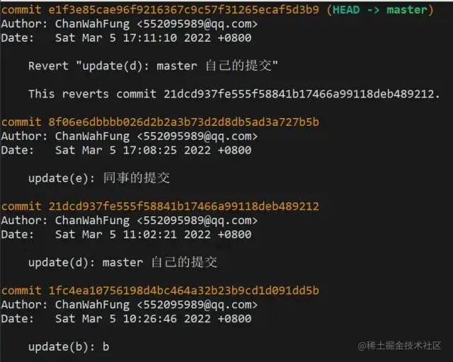

再来看下最新的 `log`，生成了一条 `revert` 记录，虽然自己之前的提交记录还是会保留着，但你修改的代码内容已经被撤回了。

### revert 合并提交

在 `git` 的 `commit` 记录里，还有一种类型是合并提交，想要 `revert` 合并提交，使用上会有些不一样。

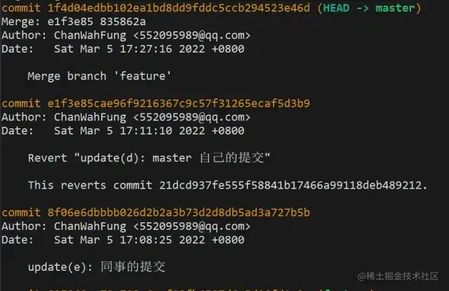

现在的 `master` 分支里多了条合并提交。

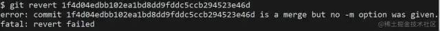

使用刚刚同样的 `revert` 方法，会发现命令行报错了。为什么会这样？在官方文档中有解释。

通常无法 `revert` 合并，因为您不知道合并的哪一侧应被视为主线。此选项指定主线的父编号（从 1 开始），并允许 `revert` 反转相对于指定父编号的更改

我的理解是因为合并提交是两条分支的交集节点，而 `git` 不知道需要撤销的哪一条分支，需要添加参数 `-m` 指定主线分支，保留主线分支的代码，另一条则被撤销。

`-m` 后面要跟一个 `parent number` 标识出"主线"，一般使用 1 保留主分支代码。

```shell
git revert -m 1 <commitHash>
```

**revert 合并提交后，再次合并分支会失效**

还是上面的场景，在 `master` 分支 `revert` 合并提交后，然后切到 `feature` 分支修复好 `bug`，再合并到 `master` 分支时，会发现之前被 `revert` 的修改内容没有重新合并进来。

因为使用 `revert` 后， `feature` 分支的 `commit` 还是会保留在 `master` 分支的记录中，当你再次合并进去时，`git` 判断有相同的 `commitHash`，就忽略了相关 `commit` 修改的内容。

这时就需要 `revert` 掉之前 `revert` 的合并提交，有点拗口，接下来看操作吧。

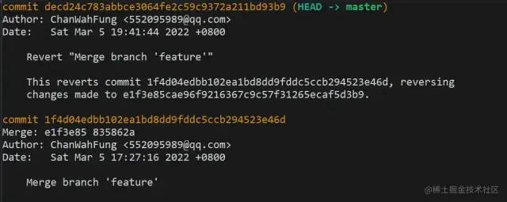

现在 `master` 的记录是这样的。

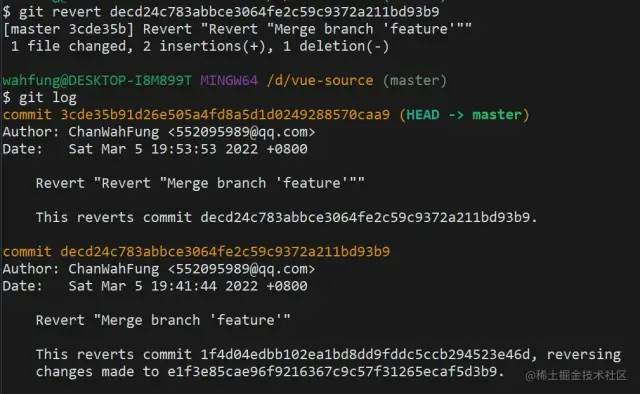

再次使用 revert，之前被 revert 的修改内容就又回来了。

## reflog

此命令管理重录中记录的信息。

如果说`reset --soft`是后悔药，那 `reflog` 就是强力后悔药。它记录了所有的 `commit` 操作记录，便于错误操作后找回记录。

### 应用场景

应用场景：某天你眼花，发现自己在其他人分支提交了代码还推到远程分支，这时因为分支只有你的最新提交，就想着使用 `reset --hard`，结果紧张不小心记错了 `commitHash`，`reset` 过头，把同事的 `commit` 搞没了。没办法，`reset --hard` 是强制回退的，找不到 `commitHash` 了，只能让同事从本地分支再推一次。

### 命令使用

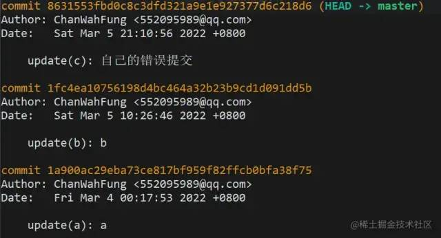

分支记录如上，想要 `reset` 到 `b`

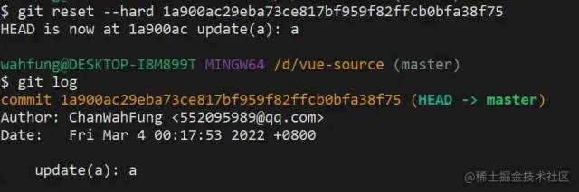

误操作 `reset` 过头，`b` 没了，最新的只剩下 `a`

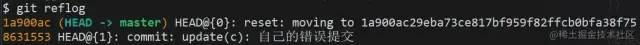

这时用`git reflog`查看历史记录，把错误提交的那次 `commitHash` 记下

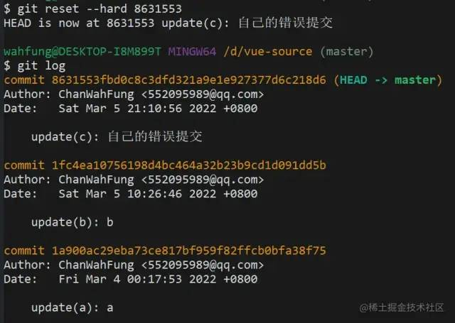

再次 `reset` 回去，就会发现 `b` 回来了
